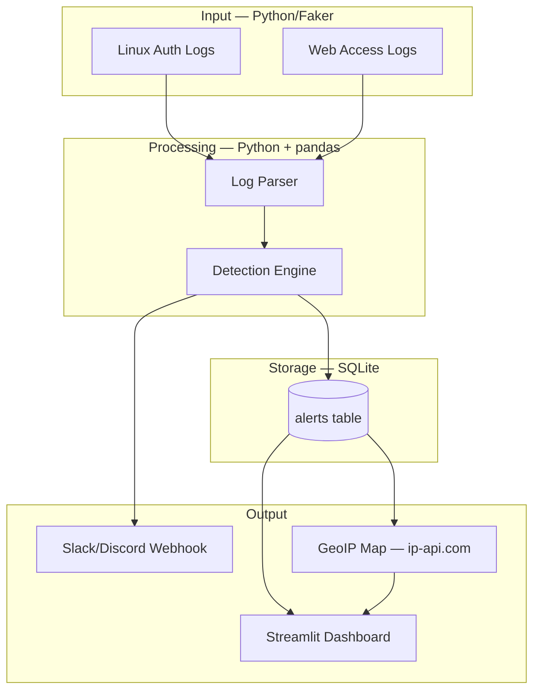
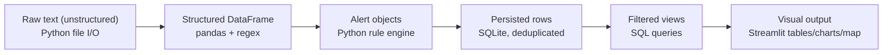
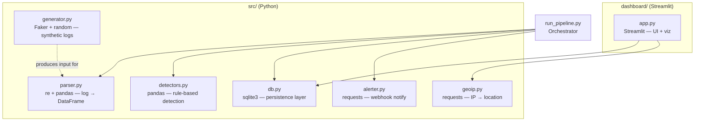
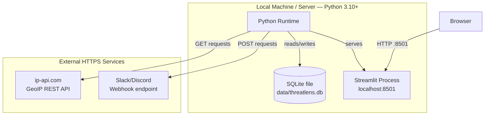
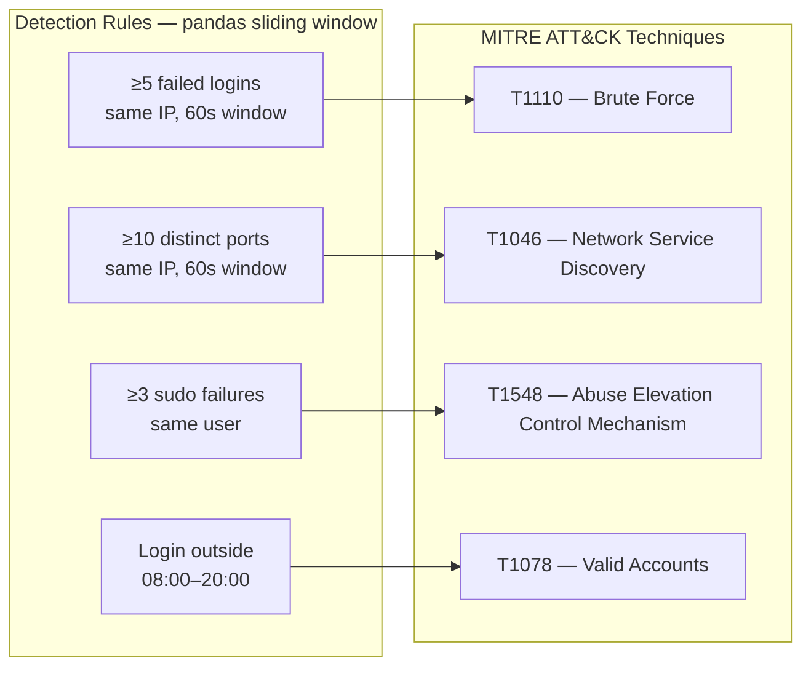

# ThreatLens — Architecture

This document covers ThreatLens's architecture from multiple angles, plus the full tech stack and why each piece was chosen.

---

## Tech Stack

| Layer | Technology | Why |
|---|---|---|
| Language | Python 3.10+ | Standard for security tooling, huge ecosystem |
| Data processing | pandas | Fast, expressive log parsing & time-window analysis |
| Detection logic | Custom rule engine (pure Python + pandas) | Full control over sliding-window logic; no black-box ML needed for interpretable SOC-style rules |
| Storage | SQLite | Zero-config, file-based, perfect for a portfolio-scale project; `UNIQUE` constraints handle dedup |
| Dashboard | Streamlit | Fastest path from Python script to interactive web UI; no separate frontend needed |
| Charts | Streamlit native charts (`st.line_chart`, `st.bar_chart`) / Plotly | Quick, clean visualizations with minimal code |
| Synthetic data | Faker + custom generators | Reproducible demo data; never blocked waiting on real attack traffic |
| GeoIP | ip-api.com (free tier) | No API key required, sufficient for demo-scale lookups |
| Alerting | Slack / Discord Incoming Webhooks | Simple HTTP POST, no SDK dependency, shows response-side thinking |
| Threat framework | MITRE ATT&CK | Industry-standard technique IDs (T1110, T1046, T1548, T1078) — the language real SOC teams use |

---

## 1. High-Level System Architecture
Major components and how they connect.



## 2. Data Flow Architecture
How raw data transforms at each stage.



## 3. Component / Module Architecture
Codebase structure and responsibilities.



## 4. Sequence Diagram — Full Run
Order of operations for one end-to-end execution.

```mermaid
flowchart TB
```

```mermaid
sequenceDiagram
    participant U as User
    participant Gen as generator.py
    participant Pipe as run_pipeline.py
    participant Par as parser.py
    participant Det as detectors.py
    participant DB as SQLite
    participant Alt as alerter.py
    participant Dash as Streamlit Dashboard

    U->>Gen: python src/generator.py
    Gen->>Gen: Write sample_auth.log / sample_access.log
    U->>Pipe: python run_pipeline.py
    Pipe->>Par: parse_log_file()
    Par-->>Pipe: structured DataFrame
    Pipe->>Det: run_all_detectors(df)
    Det-->>Pipe: list of alert dicts (MITRE-tagged)
    Pipe->>DB: insert_alerts()
    Pipe->>Alt: notify_high_severity()
    Alt-->>U: Slack/Discord message (if High severity)
    U->>Dash: streamlit run dashboard/app.py
    Dash->>DB: query_alerts()
    DB-->>Dash: alert rows
    Dash-->>U: table + charts + GeoIP map
```

## 5. Deployment / Runtime Architecture
What runs where, including external dependencies.



## 6. Detection Logic — Rules to MITRE ATT&CK Mapping



---

## Interview Quick-Reference

| If asked... | Point to |
|---|---|
| "Walk me through the architecture" | Diagram 1 |
| "How does data move through the system?" | Diagram 2 |
| "How is your code organized?" | Diagram 3 |
| "What happens when you run it?" | Diagram 4 |
| "How would this scale / deploy?" | Diagram 5 |
| "How does your detection logic work?" | Diagram 6 |
| "What's your tech stack and why?" | Tech Stack table |
