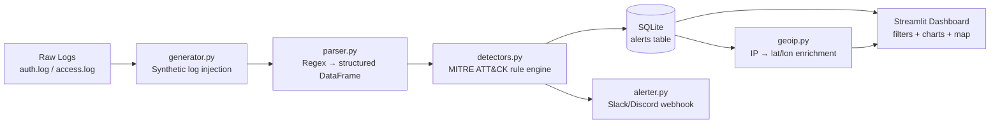

# ThreatLens 🔎

A lightweight SIEM-style log analysis and alerting dashboard that ingests Linux/web server logs, detects attack patterns using MITRE ATT&CK-mapped rules, and visualizes threats in real time — built to mirror real SOC Tier-1 triage workflows.

## Problem Statement
SOC analysts spend a large portion of their time manually triaging raw log data to spot brute-force attempts, scans, and privilege escalation. ThreatLens automates the first pass: parsing logs, applying rule-based detections mapped to industry-standard MITRE ATT&CK techniques, scoring severity, and surfacing everything on a single dashboard — reducing time-to-detection and giving analysts a starting point for deeper investigation.

## Features
- Synthetic log generator for reproducible demo data (no real attack data needed)
- Regex-based parser for SSH auth logs, sudo logs, UFW firewall logs, and web access logs
- Rule-based detection engine, each rule mapped to a MITRE ATT&CK technique
- Severity-scored alerts (Low / Medium / High) stored in SQLite with de-duplication
- Interactive Streamlit dashboard: filterable alert table, time-series and breakdown charts
- GeoIP-based attacker location map
- Slack/Discord webhook notifications on High-severity alerts
- One-click "Replay Attack" demo control

## Architecture



## MITRE ATT&CK Mapping
| Detection | Logic | Technique | ID |
|---|---|---|---|
| Brute-force login | ≥5 failed logins from 1 IP in 60s | Brute Force | T1110 |
| Port scan | ≥10 distinct ports from 1 IP in 60s | Network Service Discovery | T1046 |
| Privilege escalation | ≥3 failed sudo attempts by 1 user | Abuse Elevation Control Mechanism | T1548 |
| Off-hours login | Successful login outside 08:00–20:00 | Valid Accounts | T1078 |

## Tech Stack
Python · pandas · Streamlit · Plotly/native charts · SQLite · Faker · ip-api.com

## Setup
```bash
git clone https://github.com/Jagadeesh-31/threatlens.git
cd threatlens
pip install -r requirements.txt

# optional: enable Slack/Discord alerts
export THREATLENS_WEBHOOK_URL="your-webhook-url"
export THREATLENS_WEBHOOK_TYPE="slack"   # or "discord"

python src/generator.py      # generate synthetic logs
python run_pipeline.py       # parse + detect + store alerts
streamlit run dashboard/app.py
```

## Screenshots

_(Dashboard overview, color-coded alert table with MITRE ATT&CK mapping, interactive Plotly charts, and GeoIP attacker map)_

## Design Decisions
- **Sliding time-window detection** for brute-force/port-scan rules avoids both missed slow-burn attacks and alert-spam on every single event in a burst.
- **SQLite with UNIQUE constraints** prevents duplicate alerts on repeated pipeline runs over the same data — mirrors how real SIEM ingestion handles replayed/overlapping log sources.
- **Synthetic data generator** ensures the project is always demoable without depending on access to real attack traffic.

## Future Improvements
- Real-time log tailing instead of batch file processing
- ML-based anomaly detection layered on top of rule-based detections
- Multi-source log correlation (auth + access + firewall in one unified alert)
- User authentication on the dashboard for multi-analyst use

## Author
[Jagadeesh-31](https://github.com/Jagadeesh-31)

